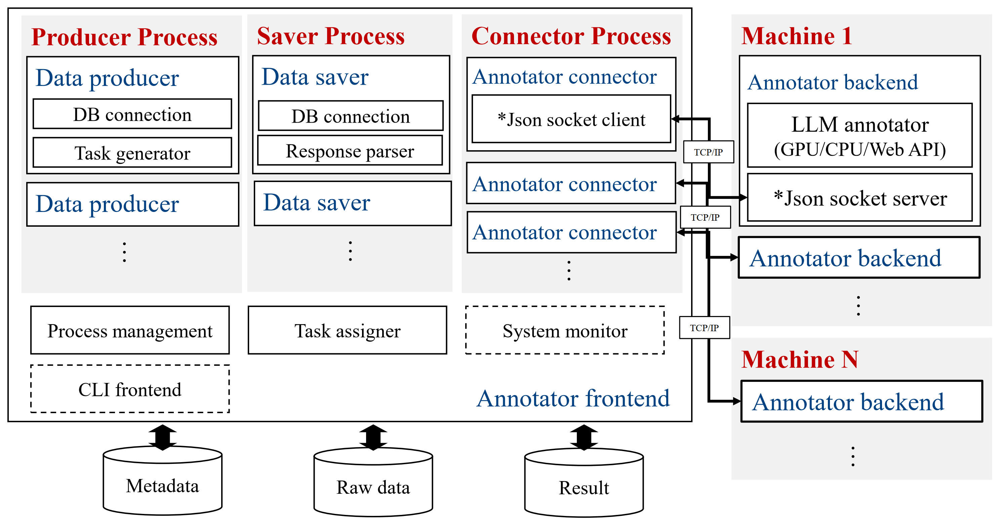

# A distributed annotation system for RSTeller

## System Overview



The caption system mainly consists of two parts: the annotator frontend and the annotator backend. The annotator backend is used to host LLM captioner in the backend and each backend hosts an LLM service instance. It can also be easily swaped with other LLM or any form of implementation regardless of running on GPU, cpu or simply using API. The annotator frontend is a multi-process application that hosts three process groups: producer process, saver process and connector process. The producer process is responsible for reading raw OSM data and interpret raw data into a formatted prompt for the annotator backend. The saver process is responsible for parsing the response from the annotator backend and saving them to the database. This design allows the programmer to easily swap the database used in this system, adding more different data producer or other parser without affecting other components. The connector process is responsible for connecting to the annotator backend and sending the data back and forth between the frontend and backend. Each backend needs a connector to keep the communication. The main process of the annotator frontend also hosts multiple threads to handle the managment of all the processes and the assignment of all captioning tasks. The process management is mainly responsible for starting and stopping the processes, and the task assignment is responsible for assigning tasks to the available annotator backend. The task assignment is based on the availability of the backend and the load of the backend. This frontend so far does not have any user interface and also lacks a system monitor to monitor the real-time performance and the load. We wish anyone who is interested in this project to contribute to this project by adding more features or improving the existing ones. **PRs are welcome!**

## Preparation for Running the System

Before running the system, make sure you have made the following preparation:

### Collecting Raw Image Patches and OSM Data

You have run the [scripts](../download) for image collection and raw OSM data collection. You have gained populated `metadata.db` and `osm.db` for the subsequent steps.

### Prepare the OSM Wiki Database

Download the OSM taginfo Wiki [database](https://taginfo.openstreetmap.org/sources/wiki) which is a sqlite database for tag interpretation in the annotation process.

### Setting up the Annotaton Database

The annotation process requires a database to store all the annotations, annotator information and prompt template. The creation of the database can be done with the data builder [notebook](../tools/database_builder.ipynb).

When the database is set up, some initial data needs to be added to the database.

1. Set up the `annotator` table with the annotator information.

    You need to add the annotator name in the `ANNOTATOR` column of the `annotator` table. This decides what annotators are available for the annotation process. The name should match the `_VALID_MODELS` provided in the `annotation/annotators` directory, which is the annotator backend you may run.

2. Set up the `prompt` table with the prompt template.

    You need to prepare the prompt template for the captioning task. Some examples of prompt template can be found [here](../docs/prompt_templates.md). Note that you need to properly include the placeholders for different types of prompt as our example prompt templates do. The prompt template should be added to the `PROMPT` column.

    Besides, you need to add a prompt type to the `TYPE` column, which is an integer value. This is used to determine the type of the prompt. In present, we only support three types of prompt: `2`, `3` and `11`, which stands for `area`, `non-area` and `caption revision`, respectively.

3. Set up the `annotator_prompt` table with the mapping between annotator and prompt.

    You need to add the mapping between annotator and prompt in the `annotator_prompt` table. This is used to determine which prompt is assigned to which annotator. The mapping should be added to the `ANNOTATOR` and `PROMPT` columns. Both columns should be integer values which is the `ID` column in the `annotator` and `prompt` table, respectively.

During the annotation process, the data producer will first randomly select a prompt template with valid type and format a "task" with prompt wrapped in it. Then the prompt is passed to task assigner which looks for valid annotators via the `annotator_prompt` table and assigns the task to the available annotator. The annotator backend will then start the captioning task and the response is saved to the database.

### Setting up Revision Database (Optional)

If you want to use the system for caption augmentation, you need an extra database to store examples of the raw captions and their corresponding revisions pairs. The creation of the revision database can be done with the data builder [notebook](../tools/database_builder.ipynb) as well. The are two tables in the revision database needed to be set up:

1. Set up the `rewrite_raw` table with the raw captions.

    The `rewrite_raw` table contains three columns need manual input: `patch_id`, `prompt_id` and `text`. The `patch_id` column is the ID of the image patch in the `patch` table for the metadata database, the `prompt_id` column is the ID of the prompt in the `prompt` table of the annotation database. Only the caption captioned with the corresponding prompt may use the raw example with the same `prompt_id`. The `text` column is the raw caption.

    The `patch_id` is used to trace back the revision pairs to the corresponding image patch which is not strictly necessary for the revision process, but it is helpful for the data management.

2. Set up the `rewrite_examples` table with the revisions.

    The `rewrite_examples` table contains two columns need manual input: `rewrite_raw_id` and `rewrite_text`. The `rewrite_raw_id` column is the ID of the raw caption in the `rewrite_raw` table, the `rewrite_text` column is the revision caption. The revision caption should be different from the raw caption.

## Running the System

### Step 1: Start the Annotator Backend

You need to start the annotator backend before running the annotator frontend. The backend can be started by running the `annotator_backend.py` script. Here is an example command:

```bash
#!/bin/bash
python annotator_backend.py \
--annotator MixtralAnnotator \
--model-id mistralai/Mistral-Nemo-Instruct-2407 \
--port 5002
```

The `annotator` argument specifies the annotator backend to use, which is `MixtralAnnotator` in this case. This is the the class name of the annotator backend in the `annotators` directory. Developers can add more annotator backends by creating new classes in the `annotators` directory which inherit from the `BaseAnnotator` class and register them in the `annotators/__init__.py` file. For now, all the annotator backends are hosted by vLLM on local machine. Developers can also write code to run on CPU or using API. Frameworks like LangChain or GraphRAG can be implemented as annotator backends to support more complicated agents.

The `model-id` argument specifies the model ID of the annotator backend, which is `mistralai/Mistral-Nemo-Instruct-2407` in this case. This is the actual model used by the annotator backend to perform the captioning task.

The `port` argument specifies the port to run the annotator backend on. Each annotator backend should have a unique port.

### Step 2: Start the Annotator Frontend

Once the annotator backends are running, you can start the annotator frontend by running the `annotator_frontend.py` script. Here is an example command:

```bash
#!/bin/bash
python annotator_frontend.py \
--db_root ../database \
--fetch_size=50 \
--map_element_threshold 2 \
--num_data_producer 4 
```

The `db_root` argument specifies the root directory of all the databases needed. The following databases are needed:

- `metadata.db`: the metadata database for image patch collection.
- `osm.db`: the OSM database for raw OSM data collection.
- `annotation.db`: the annotation database for storing all the annotations, annotator information and prompt template.
- `annotation_meta.db` (optional): the database for revision process.
- `taginfo-wiki.db`: the OSM taginfo Wiki database for tag interpretation.

The `fetch_size` argument specifies the number of rows to fetch for the data producer at a time. As frequent reading of the database can cause performance issues, we implement a batch reading mechanism to reduce the number of database queries and cache the data into the memory.

The `map_element_threshold` argument specifies the minimum number of elements in the OSM data to be considered as a valid element. Unvalid elements are filtered out before the data producer reads the data.

The `num_data_producer` argument specifies the number of data producer processes to run. Each data producer process reads the raw OSM data and interpret it into a formatted prompt for the annotator backend. The data producer process also assigns the tasks to the available annotator backend.

Note that you need to modify codes from line `283` to `286` in `annotator_frontend.py` to match the acutal annotator backends. This is hardcoded for now and may be improved in the future.
